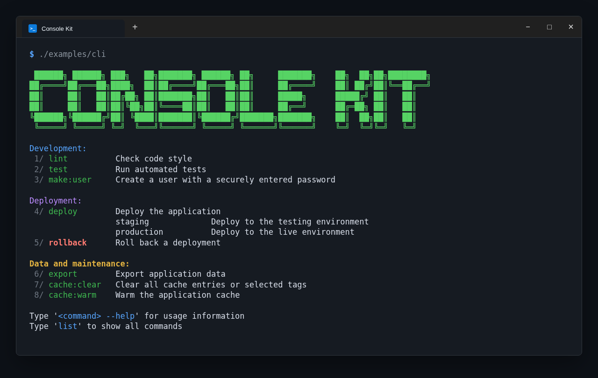
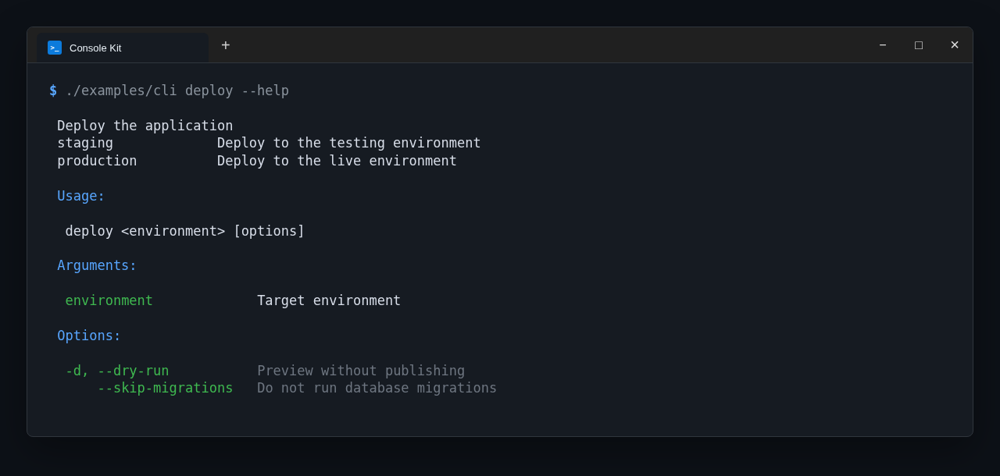

PHP Console Kit
====================

PHP Console Kit is a simple PHP library for creating command-line applications.
Library strongly inspired by [Laravel Artisan Console](https://laravel.com/docs/5.4/artisan). This project is based on [rakit/console](https://github.com/rakit/console).



## Features

* Closure command. You don't need to create class for simple command.
* Built-in command `list`.
* Auto help handler for each commands.
* Easy command signature.
* Aligned multiline command descriptions.
* Long options with hyphenated names.
* Password input.
* Simple Coloring.

## Installation

Install the package:

```bash
composer require michalskoula/console
```

## Quickstart

#### 1. Create App

Create a file named `cli` (without extension).

```php
<?php

use MichalSkoula\Console\App;

require('vendor/autoload.php');

// 1. Initialize app
$app = new App;

// 2. Register commands
$app->command('hello {name}', 'Say hello to someone', function($name) {
    $this->writeln("Hello {$name}");
});

// 3. Run app
$app->run();
```

#### 2. Running Command

Open terminal/cmd, go to your app directory, run this command:

```
php cli hello "John Doe"
```

#### 3. Command List

You can see available commands by typing this:

```
php cli list
```

#### 4. Show Help

You can show help by putting `--help` or `-h` for each command. For example:

```
php cli hello --help
```

## Command groups and colors

Use groups to organize the command list. Commands are displayed in registration order.

```php
use MichalSkoula\Console\Color;

$app->group('Maintenance', Color::RED, function () {
    $this->command('maintenance:on', 'Enable maintenance mode', function () {
        // ...
    });
});
```

The fourth argument of `command()` changes the command name color:

```php
$app->command('danger', 'Run a dangerous command', function () {
    // ...
}, Color::RED);
```

Available foreground colors are defined as `Color` constants, for example `Color::LIGHT_GREEN` and `Color::YELLOW`.

## Multiline descriptions

Command descriptions may contain multiple lines. Continuation lines are automatically aligned in both the command list and `--help` output.

```php
$app->command(
    'export',
    implode(PHP_EOL, [
        'Export records',
        'recent              Recent records only',
        'all                 All records',
    ]),
    function () {
        // ...
    }
);
```

The command list renders the continuation lines below the first description line:

```text
1/ export   Export records
            recent              Recent records only
            all                 All records
```

## Long option names

Long option names may contain hyphens and are included in help and shell autocomplete:

```php
$app->command(
    'export {--dry-run::Preview without saving} {--include-archived::Include archived records}',
    'Export records',
    function () {
        if ($this->option('dry-run')) {
            // ...
        }
    }
);
```

Running `php cli export --help` includes the declared long options:

```text
Options:
  --dry-run           Preview without saving
  --include-archived  Include archived records
```

The complete help screen stays aligned even when short aliases and long option names are mixed:



## List header

Use `setListHeader()` to replace the default `Available Commands:` text. The header supports multiple lines, including ASCII art.

```php
$app->setListHeader(<<<'HEADER'
My Console
==========
HEADER, Color::CYAN);
```

Pass a third argument in milliseconds to display the header with a typing effect:

```php
$app->setListHeader($asciiArt, Color::CYAN, 12);
```

## Shell autocomplete

Enable Bash autocomplete with a generated script.

```bash
source <(./cli completion bash)
```

To enable it permanently, generate the script once and load it from `~/.bashrc`:

```bash
./cli completion bash > ~/.cli-completion.bash
echo 'source ~/.cli-completion.bash' >> ~/.bashrc
source ~/.bashrc
```

Command names and options are detected automatically. For positional arguments,
whose possible values cannot be inferred from the command signature, declare
the allowed values explicitly:

```php
$app->command('deploy {environment}', 'Deploy the application', function (string $environment) {
    // ...
});

$app->setCompletionValues('deploy', 'environment', ['staging', 'production']);
```

## Development

Install development dependencies and run the complete quality suite:

```bash
composer install
composer check
```

The checks can also be run separately. The default commands only report changes:

```bash
composer test
composer ecs
composer rector
```

Apply automatic formatting and refactoring explicitly:

```bash
composer ecs:fix
composer rector:fix
```
